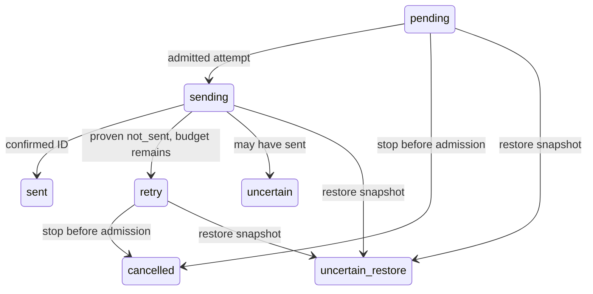

# Stage1 foundation

Four composition roots: gateway (Fastify signed/shared-secret MAX ingress), worker (ordered inbound processing), delivery (bounded MAX sends), scheduler (subscription/safety scans/retention/privacy recovery). `node dist/runtime/command.js ROLE` starts each; npm build produces the shared runtime. One non-root image wraps those commands; systemd/nginx examples and backup restoration are described in [the operations runbook](../runbooks/backup-restore.md).

Application/domain modules depend only on ports/shared types. Infrastructure adapters implement PostgreSQL/MAX/HTTP; runtime roots compose them. `npm run lint:architecture` rejects infrastructure/provider imports in application/domain, including dynamic imports/reexports. Foundations echo only; text acknowledgement, stale callback explanation and voice capability_unavailable are Stage1 behavior. Task Domain is not implemented.

| Owner | Tables and effects | Runtime authority |
|---|---|---|
|identity|users, channel_accounts, conversations, erasure jobs|gateway definer resolver/intake; scheduler narrow privacy routines; RLS tenant access|
|intake|inbound_events, processing_receipts, conversation_work|gateway atomic accept; worker fenced ordered transaction|
|delivery|outbound_messages, delivery_work, immutable delivery_attempts|worker append; delivery admitted/completion transactions|
|operations|system_state, integration_health, operator alerts, restore_incidents, generation floors|runtime narrow aggregate/repair functions; offline migrator restore/schema only|

| SQL role | Allowed work | Isolation |
|---|---|---|
|echo_gateway|atomic intake, identity resolution, health aggregate|no tenant-wide SELECT or restore changes|
|echo_worker|ordered tenant processing, receipt/outbox, system conversation claim|FORCE RLS + transaction app.user_id; guarded lease token|
|echo_delivery|claim/admit/finalize attempts and certainty|FORCE RLS + tenant transaction; guarded live lease|
|echo_scheduler|subscription metadata, bounded scans/retention/deletion|narrow definer functions; no restore control|
|echo_migrator|migrations/offline restore|NOSUPERUSER/NOBYPASSRLS; explicit migrator policies; credential absent from runtimes|

Ingress transaction resolves identity and appends event/sequence/queue atomically before200. Worker locks a valid generation/owner/expiry, observes the earliest inbound, and commits terminal result + immutable receipt + outbox + next sequence together. An unready head blocks later text until terminal outcome. Delivery admission commits an attempt before network I/O; completion locks and validates authority, appending an immutable fact and terminal/retry state. Independent sessions renew leases; deadline/session errors discard authority. Global restore guard locks system_state before work locks; operator fence waits for guarded transactions. Signals drain bounded active operations then close pools.

Restore tooling previews by default and requires explicit incident/snapshot/apply/reopen. Physical encryption authenticates data; PostgreSQL verifies required WAL. Deletion is durable and resumable, waits for admitted sends, then erases content/queues/mappings; anonymous audit remains. Technical retention cannot delete active authority or domain content. `/health/live` checks process liveness; `/health/ready` checks schema/checksum/fences; private `/ops/health` includes queue/subscription/deletion aggregates. Backup health remains unknown until deployment monitoring proves verified manifest and monthly isolated restore; local tooling does not imply production storage health.

Local checks: `npm run typecheck`, `npm run lint:architecture`, targeted `npx vitest run FILE`, `npx vitest run --config tests/e2e/review-focus.config.ts`, and manual load `npx vitest run --config tests/performance/vitest.config.ts`. Full checkpoint gate is npmci/typecheck/architecture/defaulttests/functional/build/image; invoke it once at the agreed boundary. [Real canary preparation](../runbooks/foundation-canary.md) is a separate acceptance requirement.
